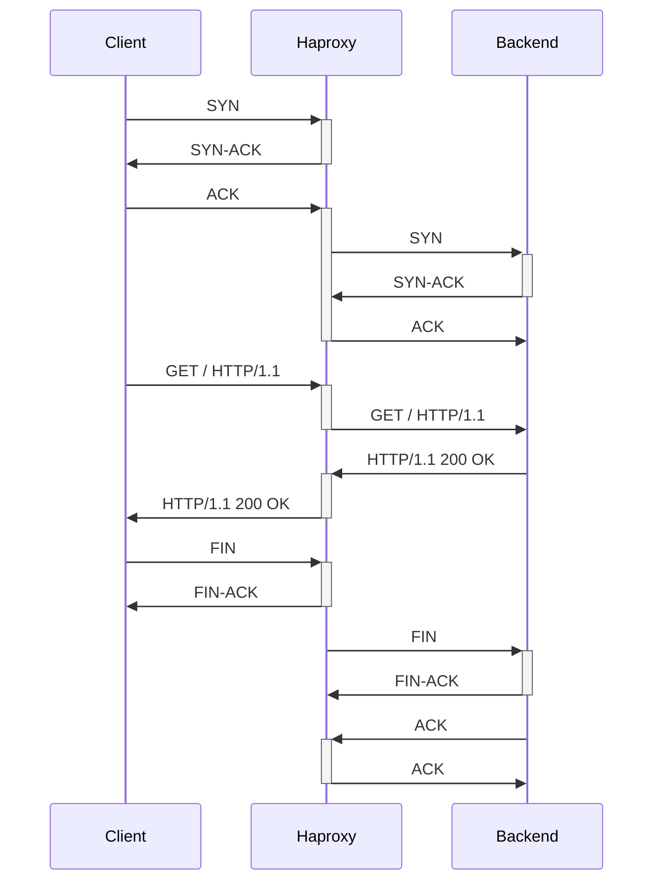
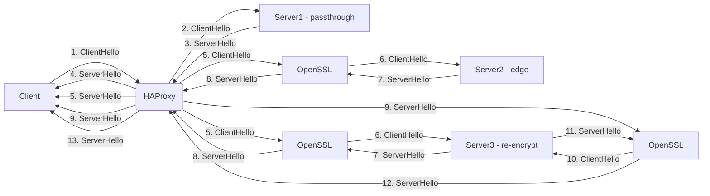
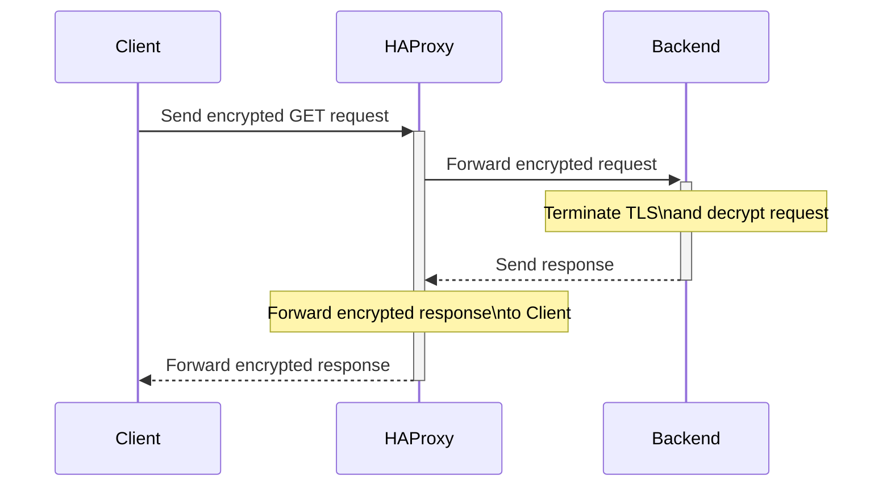
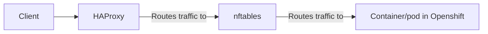

# HAProxy

HAProxy (High Availability Proxy) is a free and open-source load balancing and proxy server software. It is widely used to distribute network traffic across multiple servers, improving the reliability, scalability, and availability of web applications and services.

HAProxy can be deployed on Linux, Unix, and Windows systems and can handle various protocols including HTTP, HTTPS, TCP, and SSL/TLS. It uses a single-process, event-driven model that enables it to handle thousands of concurrent connections efficiently.

In addition to load balancing, HAProxy also provides features such as SSL termination, content switching, health checking, and access control. It is highly configurable and can be customized to suit the specific needs of an application or service.

# HTTP Traffic

Explanation of the steps:

- The client sends a SYN packet to the HAProxy load balancer.
- The HAProxy load balancer forwards the SYN packet to the backend.
- The backend responds with a SYN-ACK packet to the HAProxy load balancer.
- The HAProxy load balancer responds with an ACK packet to the client, indicating that the connection has been established.
- The client sends an HTTP request to the HAProxy load balancer.
- The HAProxy load balancer forwards the HTTP request to the backend.
- The backend responds with an HTTP response to the HAProxy load balancer.
- The HAProxy load balancer forwards the HTTP response to the client.

# HTTPS Traffic


In this flowchart, a client sends an HTTPS request to the HAProxy load balancer. The request is then forwarded to the server backend using one of the following modes: Passthrough, Edge, and Re-encrypt

# Passthrough
The HTTPS request is simply passed through HAProxy to the backend server without any modification.

# Edge
The HTTPS request is decrypted by OpenSSL and then forwarded to the backend server. The server response is then encrypted by OpenSSL before being sent back to the client.
```mermaid
sequenceDiagram
  participant Client
  participant HAProxy
  participant Backend

  Client->>+HAProxy: Send GET request
  Note over HAProxy: Terminate TLS\nand decrypt request
  HAProxy->>+Backend: Forward decrypted request
  Backend-->>-HAProxy: Send response
  Note over HAProxy: Encrypt response\nand create TLS tunnel
  HAProxy-->>-Client: Forward encrypted response
  ```
# Re-encrypt
The HTTPS request is decrypted by OpenSSL, forwarded to the backend server, and then re-encrypted by OpenSSL before being sent back to the client.
```mermaid
sequenceDiagram
  participant Client
  participant HAProxy
  participant Backend

  Client->>+HAProxy: Send encrypted GET request
  Note over HAProxy: Decrypt request\nand re-encrypt using own certificate
  HAProxy->>+Backend: Forward re-encrypted request
  Note over Backend: Terminate TLS\nand decrypt request
  Backend->>+HAProxy: Forward decrypted request
  Note over HAProxy: Encrypt response\nand create TLS tunnel to Client
  HAProxy-->>-Backend: Forward encrypted response
  Note over Backend: Encrypt response\nand create TLS tunnel to HAProxy
  Backend-->>-HAProxy: Forward encrypted response
  Note over HAProxy: Forward re-encrypted response\nto Client
  HAProxy-->>-Client: Forward re-encrypted response
```

# How does haproxy route traffic via nftables to a container?


In this flowchart, traffic from a client first goes to the HAProxy load balancer. HAProxy then routes the traffic through nftables, a firewall system used on Linux systems, to reach the container running in Openshift. This ensures that the traffic is properly routed and secured before it reaches the container.

# What is nftables?

nftables is a firewall system used on Linux systems to manage and filter network traffic. It is a successor to the widely used iptables firewall and provides a more efficient and flexible way to filter traffic.

nftables works by creating a set of rules that define how traffic should be filtered or processed. Each rule is made up of one or more conditions, such as the source or destination IP address, the protocol used, or the port number being accessed. These conditions are then combined with one or more actions, such as dropping, accepting, or forwarding the traffic.

To read an nftables rule, you need to understand its syntax. An nftables rule is made up of several parts:

- The table: This is the top-level container for rules, and it defines the type of traffic that the rule applies to. There are several types of tables, including filter, nat, and mangle.
- The chain: This is a list of rules that are executed in order, and it defines the action to be taken for each packet that matches the conditions of the rule.
- The rule: This is the specific condition or set of conditions that must be met for the packet to be processed by the chain.
- The action: This is the action that should be taken for the packet if it matches the conditions of the rule.

Here is an example of an nftables rule that drops all incoming traffic from a specific IP address:
```
table filter {
  chain input {
    type filter hook input priority 0;
    ip saddr 192.168.1.100 drop
  }
}
```
In this example, the rule is defined in the "input" chain of the "filter" table. The rule specifies that any incoming traffic with a source IP address of `192.168.1.100`.

# Sharding
```mermaid
graph LR
  subgraph sharded ingress controller
    shardedRoutes{{routes labeled 'sharded=true', shard-apps.mycluster.mydomain}} --> shardedIC[sharded ingress controller]
    shardedIC --> D[routeD]
    shardedIC --> E[routeE]
    shardedIC --> F[routeF]
    D --> G[pod1]
    D --> H[pod2]
    D --> I[pod3]
    E --> J[pod4]
    F --> K[pod5]
    F --> L[pod5]
  end
  
  subgraph default ingress controller
    unlabeledRoutes{{routes not labeled 'sharded=true', apps.mycluster.mydomain}} --> defaultIC[default ingress controller]
    defaultIC --> A[routeA]
    defaultIC --> B[routeB]
    defaultIC --> C[routeC]
    A --> M[pod6]
    A --> N[pod7]
    B --> O[pod8]
    C --> P[pod9]
    C --> Q[pod10]
    C --> R[pod11]
  end
  
  client[client http/https request] --> unlabeledRoutes
  client[client http/https request] --> unlabeledRoutes
  client[client http/https request] --> unlabeledRoutes
  client[client http/https request] --> shardedRoutes
  client[client http/https request] --> shardedRoutes
  client[client http/https request] --> shardedRoutes
```
HAProxy router sharding is a technique used to horizontally scale the routing capabilities of HAProxy.

In a typical setup, a single HAProxy instance is responsible for routing traffic to backend servers. As the traffic grows, this can become a bottleneck and limit the overall throughput of the system.

To overcome this limitation, HAProxy router sharding involves running multiple HAProxy instances in parallel and distributing the traffic between them. Each instance is responsible for routing traffic to a subset of backend servers, and together they provide a higher level of scalability and fault tolerance.

The sharding is usually done based on some sort of consistent hashing algorithm, which ensures that requests from a particular client are always routed to the same HAProxy instance. This provides session affinity, which is important for stateful applications that require requests from the same client to be handled by the same backend server.
