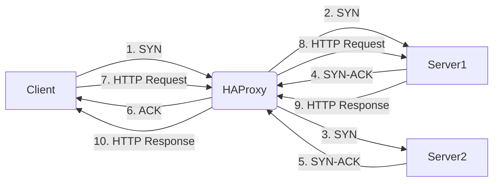
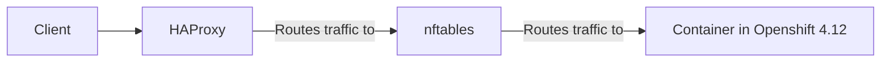

# haproxy-state-machine

Explanation of the steps:

- The client sends a SYN packet to the HAProxy load balancer.
- The HAProxy load balancer forwards the SYN packet to Server1.
- The HAProxy load balancer forwards the SYN packet to Server2.
- Server1 responds with a SYN-ACK packet to the HAProxy load balancer.
- Server2 responds with a SYN-ACK packet to the HAProxy load balancer.
- The HAProxy load balancer responds with an ACK packet to the client, indicating that the connection has been established.
- The client sends an HTTP request to the HAProxy load balancer.
- The HAProxy load balancer forwards the HTTP request to Server1.
- Server1 responds with an HTTP response to the HAProxy load balancer.
- The HAProxy load balancer forwards the HTTP response to the client.

# How does haproxy route traffic via nftables to a container?

In this flowchart, traffic from a client first goes to the HAProxy load balancer. HAProxy then routes the traffic through nftables, a firewall system used on Linux systems, to reach the container running in Openshift 4.12. This ensures that the traffic is properly routed and secured before it reaches the container.
