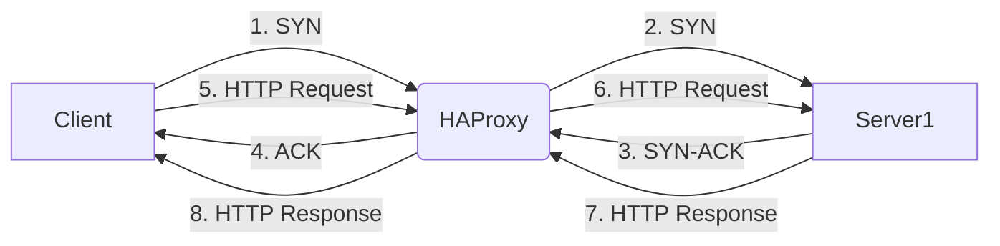
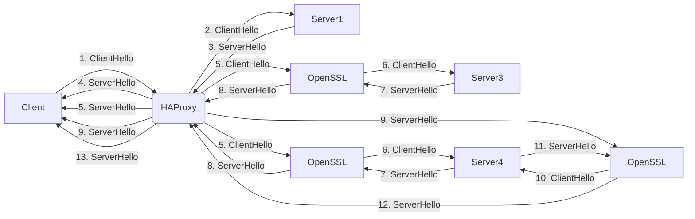
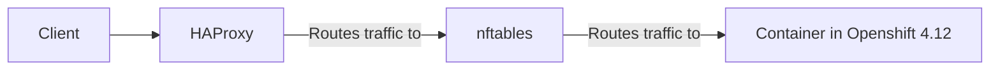

# haproxy-state-machine

HTTP:


Explanation of the steps:

- The client sends a SYN packet to the HAProxy load balancer.
- The HAProxy load balancer forwards the SYN packet to Server1.
- Server1 responds with a SYN-ACK packet to the HAProxy load balancer.
- The HAProxy load balancer responds with an ACK packet to the client, indicating that the connection has been established.
- The client sends an HTTP request to the HAProxy load balancer.
- The HAProxy load balancer forwards the HTTP request to Server1.
- Server1 responds with an HTTP response to the HAProxy load balancer.
- The HAProxy load balancer forwards the HTTP response to the client.

HTTPS:


In this flowchart, a client sends an HTTPS request to the HAProxy load balancer. The request is then forwarded to the server backend using one of the following modes:

- Passthrough: The HTTPS request is simply passed through HAProxy to the backend server without any modification.
- Edge: The HTTPS request is decrypted by OpenSSL and then forwarded to the backend server. The server response is then encrypted by OpenSSL before being sent back to the client.
- Re-encrypt: The HTTPS request is decrypted by OpenSSL, forwarded to the backend server, and then re-encrypted by OpenSSL before being sent back to the client.

The flowchart shows the steps involved in each of these modes, including the exchange of ClientHello and ServerHello messages for establishing a secure connection.

# How does haproxy route traffic via nftables to a container?


In this flowchart, traffic from a client first goes to the HAProxy load balancer. HAProxy then routes the traffic through nftables, a firewall system used on Linux systems, to reach the container running in Openshift 4.12. This ensures that the traffic is properly routed and secured before it reaches the container.

# What is nftables?

nftables is a firewall system used on Linux systems to manage and filter network traffic. It is a successor to the widely used iptables firewall and provides a more efficient and flexible way to filter traffic.

nftables works by creating a set of rules that define how traffic should be filtered or processed. Each rule is made up of one or more conditions, such as the source or destination IP address, the protocol used, or the port number being accessed. These conditions are then combined with one or more actions, such as dropping, accepting, or forwarding the traffic.

To read an nftables rule, you need to understand its syntax. An nftables rule is made up of several parts:

- The table: This is the top-level container for rules, and it defines the type of traffic that the rule applies to. There are several types of tables, including filter, nat, and mangle.
- The chain: This is a list of rules that are executed in order, and it defines the action to be taken for each packet that matches the conditions of the rule.
- The rule: This is the specific condition or set of conditions that must be met for the packet to be processed by the chain.
- The action: This is the action that should be taken for the packet if it matches the conditions of the rule.

Here is an example of an nftables rule that drops all incoming traffic from a specific IP address:
```
table filter {
  chain input {
    type filter hook input priority 0;
    ip saddr 192.168.1.100 drop
  }
}
```
In this example, the rule is defined in the "input" chain of the "filter" table. The rule specifies that any incoming traffic with a source IP address of `192.168.1.100`.
